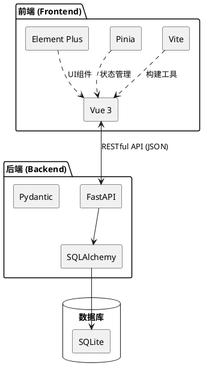
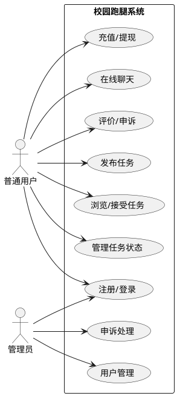
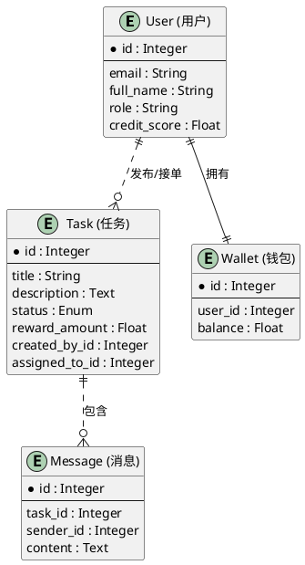
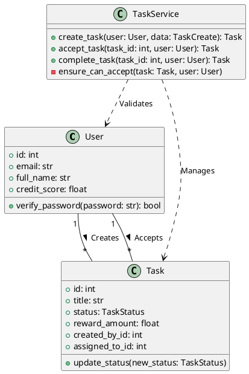

# 《校园跑腿系统》设计报告

### 目 录

- [一、设计目的](#一设计目的)
- [二、设计思路](#二设计思路)
- [三、需求分析](#三需求分析)
- [四、设计方案](#四设计方案)
- [五、开发成果展示](#五开发成果展示)
- [六、总结](#六总结)

### 一、设计目的
#### 1.1 背景与意义
随着高校校园规模的扩大和快递外卖业务的普及，“最后一公里”的配送问题日益凸显。学生群体中存在大量的代取快递、带饭、代送文件等零散需求。同时，许多学生希望利用课余时间通过打零工获得额外收入。

#### 1.2 系统目标
本系统旨在构建一个安全、便捷、高效的校园互助跑腿平台。
1.  **解决配送难题**：为有需求的学生提供便捷的下单渠道，解决取件难、送件慢的问题。
2.  **提供兼职机会**：为愿意提供服务的学生（跑腿员）提供灵活的兼职创收平台。
3.  **保障交易安全**：通过实名认证、信誉积分、资金托管等机制，保障双方权益。
4.  **提升校园生活品质**：促进校园内的互助氛围，节约学生时间成本。

### 二、设计思路
#### 2.1 技术路线
本系统采用前后端分离的架构设计，确保系统的可扩展性和维护性。

**技术架构图：**


*   **前端 (Frontend)**: 采用 **Vue 3** 框架，配合 **Vite** 构建工具，使用 **TypeScript** 增强代码健壮性。UI 组件库使用 Element Plus，状态管理使用 **Pinia**。
*   **后端 (Backend)**: 采用 **Python FastAPI** 框架，利用其异步特性处理高并发请求。ORM 框架使用 **SQLAlchemy** 进行数据库操作，数据验证使用 **Pydantic**。
*   **数据库 (Database)**: 开发阶段使用 **SQLite**，生产环境可无缝切换至 **PostgreSQL** 或 **MySQL**。
*   **接口文档**: 利用 **FastAPI** 内置的 Swagger UI 自动生成 OpenAPI 文档，极大地方便了小组内前后端的接口联调。

#### 2.2 开发流程
1.  **需求调研**：分析校园跑腿业务流程，确定核心功能模块。
2.  **系统设计**：设计数据库模型（ER图）、API 接口规范、前端页面流程。
3.  **后端开发**：实现用户认证、任务管理、支付钱包、即时通讯等核心 API。
4.  **前端开发**：搭建页面框架，对接后端接口，实现交互逻辑。
5.  **联调测试**：前后端接口联调，进行功能测试和 bug 修复。

### 三、需求分析

#### 3.1 角色分析
系统主要包含三种角色：
1.  **发布者 (Requester)**: 发布跑腿任务，支付佣金，评价跑腿员。
2.  **接单者 (Runner)**: 浏览并接受任务，执行配送，获取佣金。
3.  **管理员 (Admin)**: 管理用户、审核任务、处理申诉、提现审核。

#### 3.2 功能需求
*   **用户模块**：注册、登录、实名认证、个人信息管理、信誉积分查看。
*   **任务模块**：
    *   发布任务：填写标题、描述、金额、截止时间、取送地点。
    *   任务大厅：按距离、金额、时间筛选任务。
    *   任务流转：接单 -> 取货 -> 配送 -> 确认送达 -> 评价。
*   **钱包模块**：充值、支付任务金、收入提现、查看交易明细。
*   **消息模块**：任务相关的即时聊天，系统通知。
*   **评价与申诉**：任务完成后互评，出现纠纷可发起申诉。

#### 3.3 用例图


### 四、设计方案

#### 4.1 系统体系结构
系统采用典型的 B/S 架构（Browser/Server）。客户端通过 HTTP/HTTPS 协议与服务器进行通信，数据交换格式为 JSON。

#### 4.2 数据库设计
主要实体包括：用户(User)、任务(Task)、钱包(Wallet)、交易记录(Transaction)、聊天记录(Message)、评价(Evaluation)。

**E-R图:**


#### 4.3 类图 (核心业务类)


### 五、开发成果展示

#### 5.1 核心功能界面
> （此处应插入系统截图，如登录页、任务大厅、任务详情页等）

*   **登录/注册页**：简洁的表单设计，支持邮箱/手机号登录。
*   **任务大厅**：卡片式布局展示任务，显示任务类型（取快递、买饭）、金额和距离。
*   **任务详情**：展示地图定位、任务描述，底部有“立即接单”按钮。
*   **个人中心**：展示余额、信誉分、历史订单入口。

#### 5.2 核心代码展示
以下是任务服务层 (`TaskService`) 中关于任务状态流转控制的核心逻辑。该代码确保了任务状态只能按照预定义的流程进行流转，防止非法操作。

```python
# backend/app/services/task_service.py

ALLOWED_TRANSITIONS = {
    TaskStatus.pending: {TaskStatus.accepted, TaskStatus.cancelled},
    TaskStatus.accepted: {TaskStatus.picked, TaskStatus.cancelled},
    TaskStatus.picked: {TaskStatus.delivering},
    TaskStatus.delivering: {TaskStatus.confirming},
    TaskStatus.confirming: {TaskStatus.completed, TaskStatus.cancelled},
}

def ensure_can_update(task: Task, target_status: TaskStatus, user: User) -> None:
    """检查任务状态更新是否合法"""
    if task.created_by_id != user.id and task.assigned_to_id != user.id:
        raise HTTPException(status_code=status.HTTP_403_FORBIDDEN, detail="无权更新任务状态")

    allowed = ALLOWED_TRANSITIONS.get(task.status, set())
    if target_status not in allowed:
        raise HTTPException(status_code=400, detail="非法的状态流转")
```

#### 5.3 技术亮点与创新点

###### 5.3.1 基于 LBS 的精准地图定位
系统深度集成了高德地图 API，实现了从任务发布到接单的全流程地理位置服务：
*   **精准选点**：发布任务时，用户可通过地图组件直观选择取送货位置，系统自动逆地理编码获取详细地址。
*   **距离计算**：任务大厅实时计算用户当前位置与任务地点的距离，支持按距离排序，提升接单效率。
*   **可视化展示**：在任务详情页通过地图标记（Marker）展示地理位置，为跑腿员提供直观的导航参考。

###### 5.3.2 基于 WebSocket 的即时通讯系统
为了解决校园跑腿场景下发布者与接单者沟通滞后的痛点，系统实现了全双工的即时通讯功能：
*   **实时交互**：采用 WebSocket 协议构建长连接，实现消息的秒级送达，无需手动刷新页面。
*   **连接管理**：后端设计了 `ConnectionManager` 类，支持按任务 ID 进行消息广播，确保沟通的私密性与准确性。
*   **状态感知**：前端实时显示连接状态（在线/离线），并自动处理断线重连逻辑，保障了极端网络环境下的沟通稳定性。

### 六、总结

#### 6.1 实训收获
通过本次《校园跑腿系统》的设计与开发，我们三人小组紧密协作，深入实践了前后端分离的开发模式，收获颇丰：
1.  **团队协作与工程化**：作为三人小组，我们通过 Git 进行版本控制，利用 FastAPI 自动生成的 Swagger 文档作为前后端沟通的桥梁，实现了高效的并行开发与联调，深刻体会到了团队协作中规范化接口定义的重要性。
2.  **技术深度**：后端成员深入掌握了 FastAPI 的异步特性与 SQLAlchemy 的 ORM 映射；前端成员则在 Vue 3 组合式 API 与 TypeScript 的类型安全方面积累了实战经验。
3.  **架构思维**：通过前后端分离的实践，我们理解了如何通过职责解耦提升系统的可维护性，并掌握了从数据库建模到前端交互的全链路开发流程。

#### 6.2 不足与展望
目前系统虽然实现了核心功能，但仍有改进空间：
*   **智能调度**：目前任务主要靠人工抢单，未来可引入基于路径规划的智能派单算法，进一步提升配送效率。
*   **多端适配**：目前主要针对 Web 端优化，未来计划开发微信小程序版本，更符合校园用户的使用习惯。
*   **安全加固**：引入更完善的实名认证接口（如人脸识别）和支付加密机制，全方位保障用户信息与资金安全。

 
*本系统为校园生活提供了便利，具有较高的实用价值和推广前景。*
